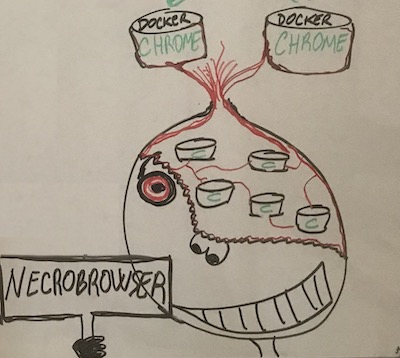

<p align="center">
  <br>
	<i>help us with a logo</i>
</p>

**Necrobrowser** is browser instrumentation for necromantic session control.

## Motto

“Whoever fights monsters should see to it that in the process he does not become a monster. And if you gaze long enough into an abyss, the abyss will gaze back into you.” 
― Friedrich Nietzsche

## About

NecroBrowser is a microservice that exposes a RESTful API allowing you
to specify which target portal to instrument via a dockerized Chrome headless instance.

The target portal is instrumented hijacking an existing authenticated session. The idea is to feed
NecroBrowser with sessions harvested during phishing campaigns (see Muraena)
to quickly perform actions on the victim behalf.

Post-phishing automation is an often underestimated activity that helps:
 - performing actions after successful session harvesting on campaigns with hundreds/thousands targets
 - backdooring accounts with new keys or credentials
 - performing automated password resets
 - extruding information
 - impersonating users to further exploit trust relationships

Each authenticated session is instrumented in a Docker container and can be kept alive to be reused
after an initial set of automated tasks completed.


Since NecroBrowser is just a browser instrumentation tool, you can also write 
automation for other phishing phases, for example initial Reconnaisance and OSINT.
Ideas are plenty, for instance:
 - keep N fake personas on LinkedIn/Twitter/YourSocialNetwork active on Chrome to monitor/scrape info from your targets
 - automatically build Social Network connections 
 - automate interaction with target contact forms/chats to get target info
 
## Requirements

- Docker (base image registry.hub.docker.com/zenika/alpine-chrome:latest)

## Notes

NecroBrowser is still experimental.

Make sure you run NecroBrowser on a machine with enough RAM if you have tens of
sessions to instrument in parallel. The cap is just how many docker containers you can spawn.

If you are brave enough to try NecroBrowser in production, remember that if you run NecroBrowser
on a different IP than the one where you perform the phishing phase, you need to SOCKS/IPSEC/VPN
your way back to the phishing IP. This is actually advised, unless you have a big enough machine
where you run both your phishing tool (see Muraena) and NecroBrowser.


# API Calls
* [`POST /instrument/<TOKEN>` | Instrument a zombie](#zombies)
* [`POST /instrumentKnown/<TOKEN>` | Instrument an existing zombie](#existing-zombie)
* [`POST /status/<TOKEN>` | Check NecroBrowser status](#status)


## Zombies Examples

- [GitHub](#github)
- [Vultr](#vultr)
- [Slack](#slack)


### Github
Request (keywords is ignored for this profile):
```json
{
	"provider": "github",
	"keywords": ["supercazzola"],
	"debugPort": 9223,
	"sessionCookies": [
	  {"name": "has_recent_activity", "value":"1", "domain":"github.com","expires":"Session","path":"/","httpOnly":true,"secure":true},
      {"name": "has_logged_in", "value":"yes", "domain":"github.com","expires":"Session","path":"/","httpOnly":true,"secure":true},
      {"name": "dotcom_user", "value":"[...]", "domain":"github.com","expires":"Session","path":"/","httpOnly":true,"secure":true},
      {"name": "_octo", "value":"[...]", "domain":"github.com","expires":"Session","path":"/","httpOnly":true,"secure":true},
      {"name": "tz", "value":"1", "domain":"github.com","expires":"Session","path":"/","httpOnly":true,"secure":true},
      {"name": "_gat", "value":"1", "domain":"github.com","expires":"Session","path":"/","httpOnly":true,"secure":true},
	  {"name": "user_session", "value":"[...]", "domain":"github.com","expires":"Session","path":"/","httpOnly":true,"secure":true},
	  {"name": "__Host-user_session_same_site", "value":"[...]", "domain":"github.com","expires":"Session","path":"/","httpOnly":true,"secure":true},
	  {"name": "_gh_sess", "value":"[...]", "domain":"github.com","expires":"Session","path":"/","httpOnly":true,"secure":true}
	]
}
```

###  Vultr
Request: 

```json
{
	"provider": "vultr",
	"keywords": ["supercazzola"],
	"debugPort": 9226,
	"sessionCookies": [
		{"name": "PHPSESSID", "value":"[...]", "domain":".my.vultr.com","expires":"Session","path":"/","httpOnly":true,"secure":true},
		{"name": "PHPSESSID_login_expire", "value":"[...]", "domain":".vultr.com","expires":"Session","path":"/","httpOnly":true,"secure":true},
		{"name": "__cfduid", "value":"[...]", "domain":".vultr.com","expires":"Session","path":"/","httpOnly":true,"secure":true},
		{"name": "auth_browser", "value":"[...]", "domain":".my.vultr.com","expires":"Session","path":"/","httpOnly":true,"secure":true},
		{"name": "cookieconsent_status", "value":"[...]", "domain":".vultr.com","expires":"Session","path":"/","httpOnly":true,"secure":true},
		{"name": "discuss_token", "value":"h%[...]%2A", "domain":".vultr.com","expires":"Session","path":"/","httpOnly":true,"secure":true},
	    {"name": "last_login_username", "value":"[...]", "domain":"my.vultr.com","expires":"Session","path":"/","httpOnly":true,"secure":true}

	]
}
```

###  Slack

Request: 

```json
{
	"provider": "slack",
	"keywords": ["supercazzola"],
	"debugPort": 9226,
	"sessionCookies": [
		{"name": "b", "value":"[...]", "domain":".slack.com","expires":"Session","path":"/","httpOnly":true,"secure":true},
		{"name": "d", "value":"[...]", "domain":".slack.com","expires":"Session","path":"/","httpOnly":true,"secure":true},
		{"name": "d-s", "value":"[...]", "domain":".slack.com","expires":"Session","path":"/","httpOnly":true,"secure":true},
		{"name": "lc", "value":"[...]", "domain":".slack.com","expires":"Session","path":"/","httpOnly":true,"secure":true},
		{"name": "x", "value":"[...]", "domain":".slack.com","expires":"Session","path":"/","httpOnly":true,"secure":true}

	]
}
```

## Existing Zombie
```json
{
	"jobId": "d2c7dec6-1d88-4184-a491-c90d5493b7ea",
	"url": "https://google.com"
	
}
```

## Status

Example response with one browser runnning:

```json
{
    "jobs": [
        {
            "id": "d2c7dec6-1d88-4184-a491-c90d5493b7ea",
            "provider": "slack",
            "Context": {
                "Context": 0
            },
            "ChromeDP": {}
        }
    ]
}
```


## License

`necrobrowser` is made with ❤️ by [the dev team](https://github.com/orgs/muraenateam/people) and it's released under the 3-Clause BSD License.
